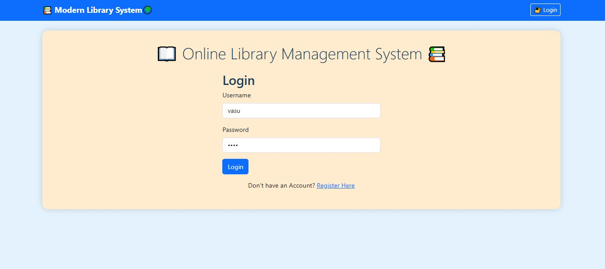
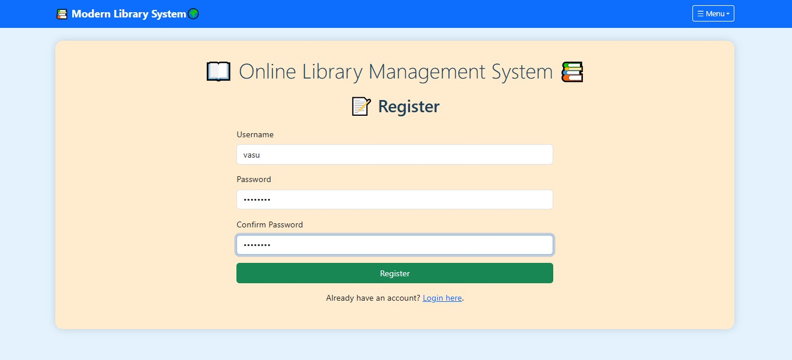
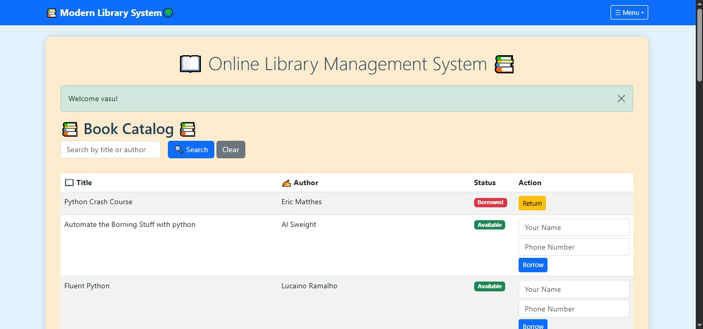
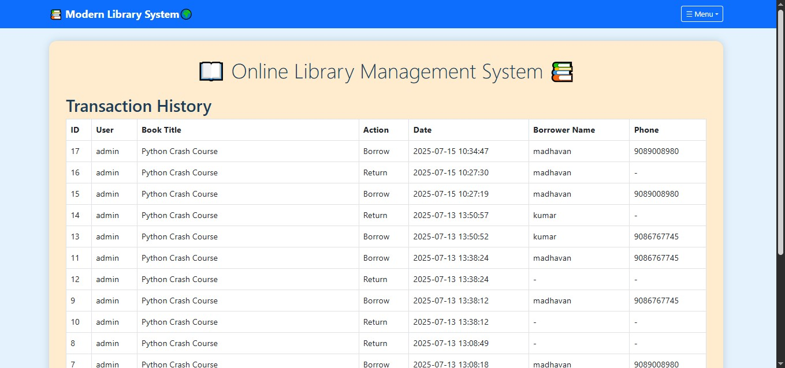

# Library-Management-System
A web-based Library Management System built with Flask and MySQL that supports authentication, book catalog management, borrow/return tracking, admin dashboard, and transaction history.

---

## 📸 Application Screenshots

### 🔐 Login Page

### 📝 Register Page

### 📊 User Dashboard

### 👨‍💼 Admin Dashboard

### ➕ Add Book

### 📜 Transaction History

